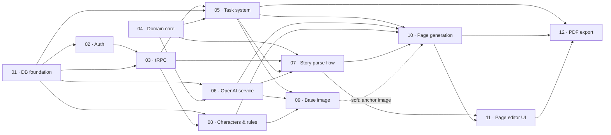

# Parallel Plan Coordination

Use this document to schedule the implementation plans in this directory across
multiple worktrees or coding agents. It supplements the dependency table in
[`00-overview.md`](00-overview.md); the individual plan remains authoritative
for its deliverables and acceptance criteria.

## Dependency graph



## Recommended execution batches

Merge each completed batch into `main` and verify it before creating downstream
worktrees. This keeps every new feature worktree based on `main`, as required by
the repository workflow.

| Batch | Work that can run in parallel | Start condition                     | Merge checkpoint                         |
| ----- | ----------------------------- | ----------------------------------- | ---------------------------------------- |
| A     | **01 + 04**                   | Immediately                         | Merge both before Batch B                |
| B     | **02 + 06**                   | 01 and 04 merged                    | 02 must merge before 03; 06 may continue |
| C     | **03**                        | 02 merged                           | Establish the shared tRPC/API structure  |
| D     | **05 + 08**                   | 03 merged; 04 already merged        | Merge both before later generation work  |
| E     | **07 + 09**                   | 05, 06, and 08 merged               | Merge both before 10                     |
| F     | **10**                        | 07 and 08 merged; preferably 09 too | Stabilize the generation seam            |
| G     | **11**                        | 10 merged                           | Stabilize the editor                     |
| H     | **12**                        | 11 merged                           | Run final integration checks             |

Two concurrent implementation worktrees is the practical maximum for this plan
set. More concurrency would require downstream branches to start from unmerged
predecessor branches, which conflicts with the branch-from-`main` workflow and
creates substantially more integration work.

## Critical path

The sequence most likely to determine total delivery time is:

```text
01 → 02 → 03 → 05 → 07 → 10 → 11 → 12
```

Schedule plans 04, 06, 08, and 09 as parallel side lanes so they finish before
the critical path reaches their integration points.

## Shared-file collision zones

| Shared seam                       | Plans                  | Coordination rule                                                                     |
| --------------------------------- | ---------------------- | ------------------------------------------------------------------------------------- |
| `src/server/domain/types.ts`      | 01, 04                 | Assign one owner. Prefer 04 defining domain types and 01 consuming them.              |
| `src/server/container.ts`         | 01, 06                 | Merge 01 first; make 06's adapter wiring additive.                                    |
| `src/server/api/routers/story.ts` | 07, 09                 | Merge 07 first; add the base-image procedure afterward.                               |
| `src/server/api/routers/page.ts`  | 10, 11                 | Keep sequential. Plan 11 explicitly extends plan 10.                                  |
| API root/router registration      | 03, 05, 07, 08, 10, 12 | Let 03 establish the pattern; later plans add registrations without restructuring it. |
| Inngest function registration     | 05, 07, 09, 10, 12     | Let 05 establish the registry; later plans only add handlers.                         |
| `package.json` and lockfile       | 01, 02, 03, 05, 06, 12 | Expect serial conflict resolution when parallel worktrees install dependencies.       |
| Wizard navigation and step state  | 07, 11, 12             | Let 07 establish navigation, then extend it in numerical order.                       |

## Batch workflow

For every batch:

1. Start each plan in its own worktree branched from the current `main`.
2. Copy `.env` into each worktree as an opaque file; never inspect it.
3. Implement the plan using the repository's plan → judge → fix workflow.
4. Merge the worktrees into `main` one at a time, resolving only known shared
   seams and preserving both plans' behavior.
5. After all worktrees in the batch are merged, run:

   ```sh
   npm run test:run
   npm run build
   npm run lint
   ```

6. Start the next batch only after the merged checkpoint is green.

## Merge order within parallel batches

- **Batch A:** merge 04 first if it owns `domain/types.ts`; otherwise merge 01
  first and reconcile the types during the 04 merge.
- **Batch B:** merge 02 and then 06. They are mostly independent, but both can
  touch configuration or dependency files.
- **Batch D:** merge 05 before 08 so the background-task and API conventions are
  stable. The plans otherwise have little direct overlap.
- **Batch E:** merge 07 before 09 because 09 extends the story router created by 07.

## Soft dependency: plan 09 → plan 10

Plan 10 can technically run without plan 09 because the base image is a soft
dependency. Prefer completing and merging 09 first anyway: it allows plan 10's
integration tests to verify that the character anchor is fetched and supplied
as the first image-generation reference. If schedule pressure requires overlap,
agree on the `Story.baseImageUrl` access and storage interfaces before starting
10, then run the anchor-path tests after merging 09.
